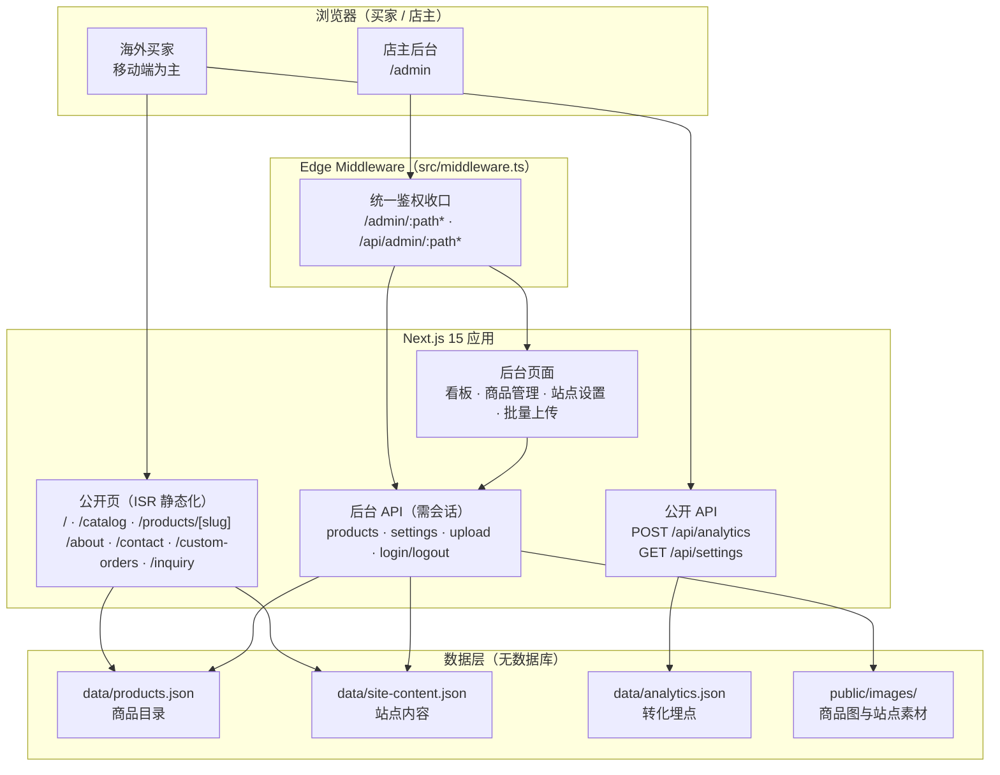
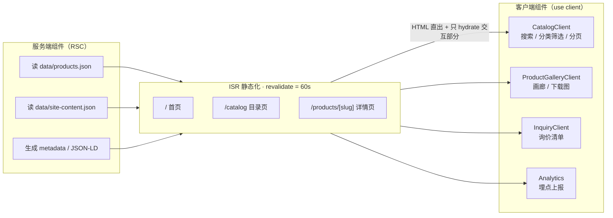
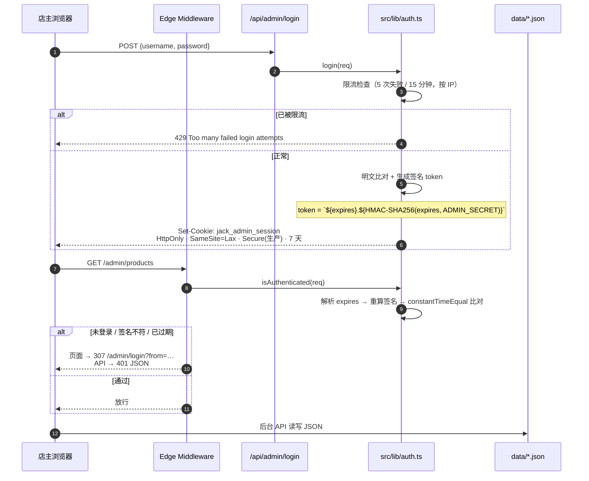
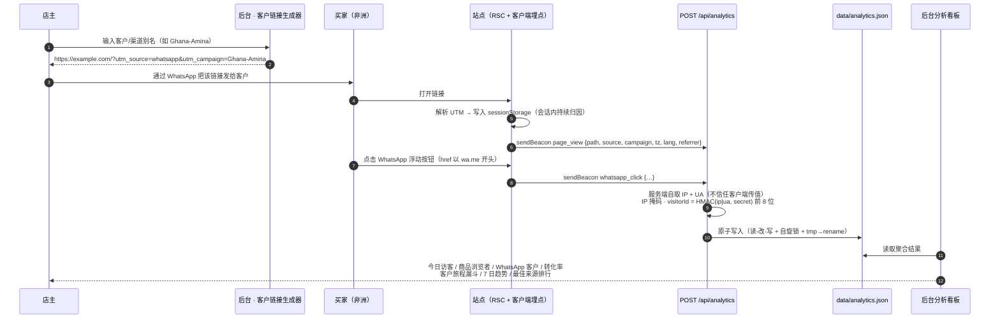
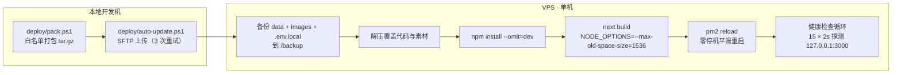

<div align="center">

# Jack African Fashion

### 面向非洲市场的 B2B 女装批发独立站

**Next.js 15 App Router · React 19 · TypeScript 5.7 · Tailwind CSS 4**

零数据库依赖 · 全链路 WhatsApp 转化归因 · 带鉴权的商品发布工作台

[](https://github.com/Konglong7/jack-african-fashion/actions/workflows/ci.yml)
[](https://nextjs.org/)
[](https://react.dev/)
[](https://www.typescriptlang.org/)
[](https://tailwindcss.com/)
[](https://vitest.dev/)
[](./LICENSE)
[](#-参与贡献)

</div>

---

## 📖 目录

- [一、项目背景与要解决的问题](#一项目背景与要解决的问题)
- [二、技术栈](#二技术栈)
- [三、系统架构](#三系统架构)
- [四、项目结构](#四项目结构)
- [五、核心技术亮点](#五核心技术亮点)
- [六、快速开始](#六快速开始)
- [七、环境变量](#七环境变量)
- [八、关键参数一览](#八关键参数一览)
- [九、设计与取舍 / 已知边界](#九设计与取舍--已知边界)
- [十、安全与脱敏说明](#十安全与脱敏说明)
- [十一、License 与免责声明](#十一license-与免责声明)

---

## 一、项目背景与要解决的问题

这是一个**为广州女装批发业务实际开发并部署运行**过的 B2B 外贸独立站（代码已脱敏开源，品牌无关的技术实现全部保留），
买家是非洲各国的服装批发商、进口商与精品店店主。

它的业务链路和典型的 B2C 电商完全不同，这决定了技术选型：

| 业务特征 | 技术后果 |
|----------|----------|
| **不做在线支付**，成交全部发生在 WhatsApp 上 | 核心指标不是"下单转化率"，而是**「谁点了 WhatsApp 按钮」**——需要一个能归因到具体客户/渠道的埋点与看板体系 |
| **批发不标零售价**，报价按数量与款式私聊 | 商品数据里存的是 `priceMin/priceMax + MOQ + 价格阶梯`，而非单一售价 |
| **买家在非洲，网络条件差** | 首屏必须轻、图片必须按设备尺寸下发、页面必须能静态化 |
| **一个店主自己维护**商品与文案 | 需要一套**不用碰代码就能上新**的后台工作台（含批量上传、就绪度校验） |
| **服务器是最便宜的 VPS** | 不能上数据库集群；数据量在"几千个商品"这个量级，**文件持久化反而更合适** |

**一句话**：这是一个「轻基础设施 + 重业务闭环」的独立站——用零数据库依赖换来部署与运维成本，把工程复杂度花在**转化归因**和**内容运营效率**上。

---

## 二、技术栈

| 层次 | 选型 | 版本 | 选它的理由 |
|------|------|------|-----------|
| 框架 | **Next.js**（App Router） | 15 | 一套代码同时覆盖 SSR/ISR 静态页、API、Edge 中间件；SEO 与首屏都拿得住 |
| UI 库 | **React** | 19 | RSC 让"数据在服务端、交互在客户端"的边界更清晰，公开页零客户端取数 |
| 语言 | **TypeScript** | 5.7 | 商品数据结构（`Product`/`SiteContent`）字段多且被后台表单、API、页面共享，类型是刚需 |
| 样式 | **Tailwind CSS** | 4 | 用 `@theme` 定义品牌色与字体变量；移动端布局靠断点工具类快速收敛 |
| 动效 | **framer-motion** | 12 | 滚动进场与视差；配合 `prefers-reduced-motion` 做可关闭 |
| 测试 | **Vitest** | 4 | 与 Vite 生态一致，零配置即可跑 TS 单测 |
| E2E | **Playwright**（Python） | — | 独立于前端依赖树，适合做"真实浏览器里的冒烟 + 截图回归" |
| 部署 | **PM2 + 1Panel/OpenResty + Let's Encrypt** | — | 单机零停机发布；`pm2 reload` 平滑重启，Web 层与证书由面板托管 |

> **刻意的"没有"**：没有数据库、没有 ORM、没有 Redis、没有消息队列、没有云存储 SDK、没有 UI 组件库、没有状态管理库。全部是**刻意的减法**，理由见 [九、设计与取舍](#九设计与取舍--已知边界)。

---

## 三、系统架构

### 3.1 分层与组件视图



### 3.2 渲染策略：把工作从客户端挪到服务端

公开页**全部在服务端取数**，客户端组件只负责交互（筛选、分页、画廊）。这样首屏不需要等 JS 加载完再发请求，也保证了海外弱网下的可用性。



**关键约束**：`/catalog` 的**服务端页面不消费 `searchParams`**（`src/app/catalog/page.tsx` 里没有任何 `searchParams`），
筛选在**客户端**读取 URL 参数后本地过滤，因此同一份静态 HTML 可被 ISR 复用 —— 这正是「筛选能分享给客户、但页面仍是静态」的关键。
（`src/app/catalog/page.test.ts` 有一条契约测试专门守住"服务端页面不得引入 `searchParams`"，防止有人顺手把它改回动态渲染。）
代价是筛选后的结果虽然 URL 可分享，但**不会被搜索引擎收录**为独立页面。

### 3.3 管理后台鉴权：签名 Cookie（不是 JWT）



用**签名 Cookie 而不是 JWT** 的原因：只需要"能证明这个会话是这个服务端签发的"这一件事，不需要承载声明、也不需要跨服务校验；签名 Cookie 更小、无需解析库、且天然能走 `HttpOnly`。

### 3.4 WhatsApp 转化归因闭环（本项目的业务核心）

B2B 站点的成交在 WhatsApp 里，所以**「谁点了按钮」就是核心指标**。这套闭环完全自研，不依赖任何第三方分析 SDK：



**这个闭环里几个值得说的细节**：

- **归因不会因为跳页而丢**：URL 上有 UTM 就用 URL 的，否则回退 `sessionStorage` 里上一次的值 —— 客户从着陆页逛到商品详情页再点 WhatsApp，仍然算在原始渠道头上。
- **不信任客户端上报的 IP**：服务端自己从 header 取，并**掩码后**才落盘；访客标识用 `HMAC-SHA256(ip + userAgent, ADMIN_SECRET)` 取前 8 位十六进制，**明文 IP 不落盘**。
- **上报不阻塞用户**：优先 `navigator.sendBeacon`，降级 `fetch(keepalive)`；接口对任何输入异常都吞掉并恒返回 `{ok:true}`，绝不让埋点影响页面。
- **可选的 GA4 双写**：配置了 `NEXT_PUBLIC_GA_MEASUREMENT_ID` 就同时镜像一份到 GA4，没配置就完全不加载 GA 脚本。

---

## 四、项目结构

```
jack-african-fashion/
├── src/
│   ├── middleware.ts                  # ★ Edge 鉴权收口：/admin/* 与 /api/admin/*
│   ├── app/                           # App Router
│   │   ├── layout.tsx                 #   根布局：metadata · OG · icons · RootChrome
│   │   ├── page.tsx                   #   首页（ISR 60s）
│   │   ├── catalog/                   #   目录页：page.tsx(RSC/ISR) + CatalogClient.tsx(筛选分页)
│   │   ├── products/[slug]/           #   商品详情：page + ProductInfo + ProductDetailSections + jsonLd
│   │   ├── about/ contact/ custom-orders/ inquiry/
│   │   ├── admin/                     #   后台：看板 · login · products · settings · upload
│   │   ├── api/                       #   8 个 Route Handler
│   │   │   ├── admin/{login,logout,products,products/[id],settings,upload}/
│   │   │   ├── analytics/route.ts     #   ★ 公开埋点接收端
│   │   │   └── settings/route.ts      #   公开站点内容（只读）
│   │   ├── sitemap.ts robots.ts manifest.ts
│   │   └── globals.css                #   Tailwind 4 @theme 品牌色 + 字体变量
│   ├── components/
│   │   ├── home/                      #   Hero · Categories · PopularProducts · WhyChooseUs …
│   │   ├── motion/                    #   Reveal · Marquee（framer-motion 封装）
│   │   ├── admin/                     #   UploadQueue · UploadedGallery · ImageLightbox
│   │   └── ProductCard · ProductImage · Header · Footer · WhatsAppFloating · Analytics …
│   └── lib/                           # 领域与基础设施
│       ├── db.ts                      #   ★ 商品持久化：缓存 + 自旋锁 + tmp→rename 原子写
│       ├── siteContent.ts             #   站点内容持久化（同一套模式）
│       ├── auth.ts                    #   ★ 签名 Cookie 会话 + 常量时间比较 + 限流接入
│       ├── rateLimit.ts               #   登录失败限流（5 次 / 15 分钟）
│       ├── analyticsStore.ts          #   ★ 埋点存储与聚合（访客去重 · 30 天 · 5000 条上限）
│       ├── analyticsAttribution.ts    #   UTM 归因解析与 sessionStorage 回退
│       ├── customerLink.ts            #   客户/渠道专属链接生成（UTM 拼装 + 别名校验）
│       ├── productValidation / Defaults / Readiness.ts   # 商品规范化与"上架就绪度"
│       ├── uploadValidation.ts        #   上传白名单与体积限制
│       ├── apiRequest.ts              #   请求体解析统一兜底
│       └── site.ts siteImages.ts siteNavigation.ts inquiry.ts downloadImage.ts
├── data/                              # 数据层（无数据库）
│   ├── products.json                  #   商品目录（仓库内为 12 条 Demo 数据）
│   ├── site-content.json              #   站点内容（后台可视化编辑）
│   └── analytics.json                 #   转化埋点（.gitignore 忽略，不入库）
├── public/images/{products,site}/     # 商品图与站点素材
├── tests/e2e/                         # Playwright 端到端脚本（Python，3 个）
├── deploy/                            # 部署工具链
│   ├── config.ps1                     #   ★ 统一读环境变量，仓库内零硬编码基础设施
│   ├── deploy.config.example.ps1      #   部署参数模板
│   ├── deploy.sh / deploy-auto.sh     #   服务器首次部署（Node + PM2；Web 层与证书交给 1Panel）
│   ├── update.sh / auto-update.ps1    #   增量更新（本地打包 → SFTP → 远端构建 → pm2 reload）
│   └── pack.ps1 / sync-*-cert.sh
├── docs/                              # 设计文档、Review、Bug Report、测试计划
├── .github/workflows/ci.yml           # 质量门禁 + 凭据入库检查
├── .env.example                       # 环境变量模板（真实 .env.local 不入库）
└── ecosystem.config.cjs               # PM2 进程配置
```

---

## 五、核心技术亮点

### 5.1 零数据库的原子持久化

数据量在"几千条商品"这个量级时，引入数据库意味着多一份运维成本（备份、迁移、连接池、权限）。本项目用**一套统一的文件持久化模式**替代，三个存储模块（商品/站点内容/埋点）复用同一套写法：

```ts
// src/lib/db.ts:127-146（简化）
let cache: Product[] | null = null;   // 进程内缓存，命中即返回
let writeLock = false;                 // 布尔自旋锁

async function writeAllAtomic(products: Product[]) {
  while (writeLock) await new Promise((r) => setTimeout(r, 50));
  writeLock = true;
  try {
    const tempFile = DATA_FILE + '.tmp';
    await writeFile(tempFile, JSON.stringify(products, null, 2), 'utf-8');
    await fs.rename(tempFile, DATA_FILE);   // ★ 原子替换，避免读到写了一半的文件
    cache = products;                       // ★ 写成功才回填缓存
  } finally {
    writeLock = false;
  }
}
```

**三个关键设计**：

| 机制 | 解决的问题 |
|------|-----------|
| `tmp → rename` 原子写 | 断电/进程被杀时，不会留下被截断的 JSON；读者要么看到旧文件、要么看到新文件 |
| 进程内缓存 + 写后回填 | 公开页每次渲染都要读商品列表，走内存避免重复 I/O |
| 布尔自旋锁 | 同一进程内并发写请求串行化（Node 单线程下已足够） |

配套的**一致性细节**：`deleteProduct()` 在删除商品后会检查它的图片是否仍被其他商品引用，不再被引用才删除文件（`src/lib/db.ts:222-247`），避免留下孤儿图或误删共用图。

### 5.2 会话鉴权：签名 Cookie + 常量时间比较 + 限流

```ts
// src/lib/auth.ts:101-109（简化）
const token = `${expires}.${await sign(String(expires), creds.secret)}`;
res.cookies.set(SESSION_COOKIE, token, {
  httpOnly: true,
  secure: process.env.NODE_ENV === 'production',
  sameSite: 'lax',
  maxAge: MAX_AGE_SECONDS,
  path: '/'
});
```

| 防护点 | 实现 |
|--------|------|
| 会话伪造 | `HMAC-SHA256(过期时间戳, ADMIN_SECRET)`，密钥只在服务端环境变量里 |
| 时序攻击 | 自实现 `constantTimeEqual`（`src/lib/auth.ts:147-156`），逐字符异或累积，不用 `===` 比较签名 |
| 暴力破解 | 登录失败限流 5 次 / 15 分钟窗口，按 `x-forwarded-for` 或 `x-real-ip` 识别来源（`src/lib/rateLimit.ts`） |
| XSS 窃取 | `HttpOnly` + `SameSite=Lax` |
| 生产误配 | 生产环境缺少 `ADMIN_USERNAME/PASSWORD/SECRET` 或 `ADMIN_SECRET < 32` 字符 → **直接抛错拒绝启动** |
| 开发期踩坑 | 用了内置开发占位口令时，启动会打印醒目的 `[SECURITY]` 告警 |
| Edge 运行时限制 | 签名只用 Web Crypto（`crypto.subtle`），不依赖 Node 的 `crypto`/`Buffer` —— 有一条契约测试（`auth.edge.test.ts`）专门守住这个约束 |

### 5.3 Edge Middleware 统一收口

鉴权**不做在每个 API 里**，而是集中在中间件一处：

```ts
// src/middleware.ts:36-38
export const config = { matcher: ['/admin/:path*', '/api/admin/:path*'] };
```

- 未登录访问页面 → `307 /admin/login?from=<原路径>`（`NextResponse.redirect` 的默认状态码，仓库 E2E 断言的就是 307），登录后能跳回去；
- 未登录访问 API → `401 JSON`（而不是重定向，否则前端会拿到一段 HTML）；
- `/admin/login` 与其 API 显式放行。

> **一个真实的踩坑记录**（保留在 `docs/BUG_REPORT.md`）：中间件最初被放在了项目根目录而不是 `src/` 下，导致 `matcher` 完全不生效、**`/admin` 实际上处于未受保护状态**。这类"配置没报错但也没生效"的问题正是靠端到端安全回归脚本（`tests/e2e/test_security.py`）才暴露出来的 —— 这也是本项目坚持保留 E2E 脚本的原因。

### 5.4 自研轻量转化分析（无第三方 SDK）

`data/analytics.json` 的数据结构（`src/lib/analyticsStore.ts:23-33`）：

```
totals{page_view, whatsapp_click}
days{ "YYYY-MM-DD": {page_view, whatsapp_click} }     # 按 Asia/Shanghai 分桶
pages{ path: count } / whatsappPages{ path: count }
campaigns{ "source / campaign": count }
knownVisitors[] / recent[] / statsStartedAt / updatedAt
```

看板计算的指标：`Lifetime visitors`、`Total page views`、`Total WhatsApp clicks`、`Today visitors`、`Product viewers`、`WhatsApp customers`、**`WhatsApp rate`（转化率）**、`Customer journey`（访客 → 商品浏览者 → WhatsApp 的三段漏斗）、`7-day WhatsApp trend`、`Best lead sources (Last 30 days)`。

**隐私与体量控制**（这是自研分析最容易翻车的地方，所以逐条做了限制）：

| 控制项 | 值 | 位置 |
|--------|-----|------|
| 访客标识 | `HMAC-SHA256(ip + ua, ADMIN_SECRET)` 前 8 位十六进制 | `analyticsStore.ts:123-127` |
| IP 落盘 | **掩码后**才存 | `analyticsStore.ts:100-111` |
| 事件保留期 | **30 天** | `analyticsStore.ts:44` |
| `recent` 数组上限 | **5000 条**，超出裁剪 | `analyticsStore.ts:43,159` |
| 同源重复上报去重窗口 | **10 秒** | `analyticsStore.ts:45,215-223` |
| 请求体上限 | **4096 字符**，超出直接忽略 | `api/analytics/route.ts:9` |
| 各字段长度清洗 | source 60 / campaign 80 / timezone 50 / language 20 / referrer 120（`analyticsStore.ts:132-136`）；path 160（`:265`）；visitorId 24（`:240`） |
| 日分桶时区 | `Asia/Shanghai`（对广州发货的店主而言"今天"才是今天） | `analyticsStore.ts:206` |

### 5.5 ISR + 图片优化：把非洲弱网也算进去

| 措施 | 配置 | 位置 |
|------|------|------|
| 首页/目录/详情页静态化 | `revalidate = 60`（秒） | `page.tsx:19`、`catalog/page.tsx:10`、`products/[slug]/page.tsx:18` |
| 详情页预生成 | `generateStaticParams` | `products/[slug]/page.tsx:20` |
| 现代图片格式 | `['image/avif', 'image/webp']` | `next.config.ts:30` |
| 图片质量 | `qualities: [85]` | `next.config.ts:31` |
| 图片缓存 | `minimumCacheTTL: 14_400`（4 小时） | `next.config.ts:32` |
| 响应式尺寸 | 8 档 `deviceSizes` + 8 档 `imageSizes` | `next.config.ts:33-34` |
| 商品卡响应式 `sizes` | `(max-width:768px) 50vw, (max-width:1200px) 33vw, 25vw` | `ProductImage.tsx:35` |
| 首屏 LCP 优先 | 目录页前 4 张卡片加 `priority` | `CatalogClient.tsx:281` |
| 第三方包体积 | `optimizePackageImports: ['framer-motion']` | `next.config.ts:6` |
| 生产移除 console | `removeConsole` | `next.config.ts:9` |
| 远程图片 SSRF 防护 | `remotePatterns` 限定可信域名 | `next.config.ts:36-41` |

### 5.6 安全响应头

```ts
// next.config.ts:43-67
X-Content-Type-Options: nosniff
X-Frame-Options: SAMEORIGIN
Referrer-Policy: strict-origin-when-cross-origin
Permissions-Policy: camera=(), microphone=(), geolocation=()
```

### 5.7 商品"上架就绪度"与批量上传工作台

面向"一个店主自己上新"的场景，做了两层保障：

- **规范化与就绪度**：`productValidation.ts` / `productDefaults.ts` / `productReadiness.ts` 负责在保存前把商品对象补齐、清洗、并给出**"这条商品能不能上架"的判定**（缺图、缺尺寸、缺描述等），看板上还会直接列出"缺图商品"提醒补图。
- **批量上传**：拖拽队列（`UploadQueue.tsx`，支持排序）→ 逐个校验（`uploadValidation.ts`：**单文件 8MB 上限、扩展名白名单 `.jpg/.jpeg/.png/.webp`**）→ 上传到 `public/images/products/`，文件名带 **4 字节随机 nonce** 防覆盖冲突（`api/admin/upload/route.ts:63`）。

### 5.8 测试策略

| 类型 | 数量 | 位置 | 说明 |
|------|------|------|------|
| 单元测试 | **24 个文件** | `src/**/*.test.ts` | Vitest，node 环境 |
| 端到端脚本 | **3 个** | `tests/e2e/*.py` | Playwright：全站功能冒烟、安全回归、后台 UI 截图 |
| CI 门禁 | 2 个 job | `.github/workflows/ci.yml` | lint · type-check · test · build + 凭据入库检查 |

值得单独说明的是其中有 **6 个"源码契约测试"** —— 它们读取源码文件做字符串断言，用来锁住一些**容易被后来者无意破坏的架构约束**：

| 契约测试 | 守住什么 |
|----------|----------|
| `auth.edge.test.ts` | `auth.ts` 不得引入 Node 专属的 `crypto` / `Buffer`（否则 Edge 中间件会崩） |
| `catalog/page.test.ts` | `/catalog` 不得出现 `searchParams`（否则 ISR 静态化失效） |
| `products/[slug]/page.test.ts` | 详情页必须保留 `generateStaticParams` |
| `Analytics.test.ts` | 埋点协议与看板消费端字段保持一致 |
| `mobileConversionLayout.test.ts` / `homeImageLayout.test.ts` | 移动端转化布局与图片填充模式不被改回 |

### 5.9 部署与零停机更新



| 能力 | 实现 |
|------|------|
| 配置外置 | `deploy/config.ps1` 统一读 `VPS_HOST` / `VPS_USER` / `REMOTE_DIR` / `PM2_APP_NAME` / `SITE_URL`，**仓库内零基础设施硬编码**；缺必填项直接报错退出 |
| 私密配置隔离 | 真实值放 `deploy/deploy.config.local.ps1`（已 gitignore） |
| 打包安全 | `pack.ps1` 用**白名单**方式打包（只带 `src public data deploy` + 配置文件），**不会把 `.env.local` 打进包里** |
| 凭据存储 | SSH 口令用 Windows DPAPI 加密存到 `%USERPROFILE%\.ssh\`，仅当前用户可解密 |
| 发布安全 | 发布前先备份 `data` + `public/images/products` + `.env.local` 到 `/backup` |
| 零停机 | `pm2 reload` + 15 次健康探测，失败则打印最近日志 |
| 服务器初始化 | `deploy.sh` 覆盖 Node/PM2、swap 兜底、`.env.local` 权限 600、每日备份 cron（**不装 Nginx**——避免与面板的 OpenResty 冲突，Web 层与 HTTPS 证书引导到 1Panel 面板完成） |

### 5.10 构建产物量化（`npm run build` 实测）

下面是本机 `npm run build` 的**真实输出**（Node 20 / 仓库内 12 条 Demo 商品）：

| 指标 | 实测值 |
|------|--------|
| 构建输出的路由条目总数 | **35 条**（Next 打印 `Generating static pages (35/35)`） |
| 其中：静态页 `○` | **14 条**（`/`、`/about`、`/catalog`、`/contact`、`/custom-orders`、`/inquiry`、4 个 `/admin/*` 页面、`/robots.txt`、`/sitemap.xml`、`/manifest.webmanifest`、`/_not-found`） |
| 其中：SSG + ISR `●` | **12 条**（`/products/[slug]`，由 `generateStaticParams` 生成） |
| 其中：动态渲染 `ƒ` | **9 条**（`/admin` + 8 个 API route） |
| 首页 First Load JS | **174 kB** |
| 目录页 `/catalog` First Load JS | **120 kB** |
| 商品详情页 First Load JS | **165 kB** |
| 所有页面共享 JS | **102 kB** |
| Edge Middleware 体积 | **34.7 kB** |
| ISR 重验证间隔 | **1m**（首页 / 目录 / 详情页三者在构建输出的 `Revalidate` 列中均为 `1m`） |

```
Route (app)                              Size  First Load JS  Revalidate
┌ ○ /                                 16.5 kB         174 kB          1m
├ ○ /catalog                          4.03 kB         120 kB          1m
├ ● /products/[slug]                   8.3 kB         165 kB          1m
├ ƒ /admin                            1.12 kB         107 kB
...
ƒ Middleware                                         34.7 kB
```

> `○` Static · `●` SSG（`generateStaticParams`）· `ƒ` Dynamic
>
> 可以看到：**公开页全是静态/SSG，只有 `/admin` 与 API 是动态渲染** —— 这正是 [3.2](#32-渲染策略把工作从客户端挪到服务端) 那套"筛选留在客户端换取 ISR"设计的直接结果。
> 预渲染页数取决于 `data/products.json` 的商品条数（仓库内是 12 条 Demo），换成你自己的商品库后该数字会随之增长。

## 六、快速开始

### 前置要求

| 依赖 | 版本 |
|------|------|
| Node.js | 20+ |
| npm | 10+ |
| Python（可选，跑 E2E） | 3.10+ |

### 1. 安装与配置

```bash
npm install
cp .env.example .env.local
```

`.env.local` 至少需要（模板里已列出全部变量）：

```ini
ADMIN_USERNAME=admin
ADMIN_PASSWORD=change-me-to-a-strong-password     # 至少 12 位，含大小写+数字+符号
ADMIN_SECRET=change-me-to-a-random-32-byte-hex-string
NEXT_PUBLIC_SITE_URL=http://localhost:3000
```

生成强密钥：

```bash
node -e "console.log(require('crypto').randomBytes(32).toString('hex'))"
```

> 本机开发若暂时不配置，应用会退回源码中的**开发占位口令**并打印 `[SECURITY]` 告警；
> 但 `NODE_ENV=production` 下缺少这三个变量会**直接抛错拒绝启动**。

### 2. 启动

```bash
npm run dev          # http://localhost:3000
# 管理后台：http://localhost:3000/admin  （用上面配置的账号登录）
```

### 3. 质量检查

```bash
npm run lint         # ESLint
npm run type-check   # tsc --noEmit
npm run test         # Vitest（24 个测试文件）
npm run build        # 生产构建
```

### 4. 端到端验收（可选）

```bash
pip install playwright && playwright install chromium
npm run dev                       # 另开一个终端
cd tests/e2e
python test_full.py               # 全站功能冒烟 + 截图
python test_security.py           # 安全回归（未鉴权访问、限流、畸形请求体）
```

### 5. 部署到 VPS（可选）

```bash
# 一次性：配置连接信息
Copy-Item deploy\deploy.config.example.ps1 deploy\deploy.config.local.ps1
# 编辑 deploy.config.local.ps1 填入 VPS_HOST 等
powershell -ExecutionPolicy Bypass -File deploy\setup-vps-cred.ps1

# 日常更新（打包 → 上传 → 远端构建 → 零停机重启 → 验证）
powershell -ExecutionPolicy Bypass -File deploy\auto-update.ps1
```

---

## 七、环境变量

| 变量 | 必需 | 默认/示例 | 说明 |
|------|------|-----------|------|
| `ADMIN_USERNAME` | 生产必需 | `admin` | 后台登录用户名 |
| `ADMIN_PASSWORD` | 生产必需 | — | 后台登录口令，建议 12+ 位 |
| `ADMIN_SECRET` | 生产必需 | — | 会话签名密钥，**至少 32 字符**；同时用作访客 ID 的 HMAC 盐 |
| `NEXT_PUBLIC_SITE_URL` | 建议 | `http://localhost:3000` | 用于 sitemap / robots / OG 绝对 URL |
| `NEXT_PUBLIC_GA_MEASUREMENT_ID` | 可选 | — | 配置后镜像上报一份到 GA4，未配置则不加载 GA |
| `VPS_HOST` | 部署必需 | — | 目标服务器地址（`deploy/config.ps1` 读取） |
| `VPS_USER` / `REMOTE_DIR` / `PM2_APP_NAME` / `SITE_URL` | 可选 | `root` / `/var/www/jack-fashion-current` / `jack-fashion` / `https://example.com` | 部署参数 |

---

## 八、关键参数一览

全部来自源码，可直接核对。

| 类别 | 参数 | 值 | 位置 |
|------|------|-----|------|
| 会话 | 有效期 | **7 天** | `src/lib/auth.ts:6` |
| 会话 | Cookie 名 | `jack_admin_session` | `src/lib/auth.ts:5` |
| 鉴权 | 生产密钥最小长度 | **32 字符** | `src/lib/auth.ts:19` |
| 限流 | 登录失败上限 / 窗口 | **5 次 / 15 分钟** | `src/lib/rateLimit.ts:34-35` |
| 渲染 | ISR 重验证 | **60 秒**（首页/目录/详情） | `page.tsx:19` 等 |
| 上传 | 单文件上限 | **8 MB** | `src/lib/uploadValidation.ts:3` |
| 上传 | 允许扩展名 | `.jpg .jpeg .png .webp` | `src/lib/uploadValidation.ts:4-9` |
| 上传 | 文件名 nonce | 4 字节随机 | `api/admin/upload/route.ts:63` |
| 目录 | 首屏商品数 / Load More 步进 | **24 / +24**（无分页，点击累加） | `CatalogClient.tsx:17,40,287-297` |
| 目录 | 搜索防抖 | **300 ms** | `CatalogClient.tsx:53` |
| 首页 | 商品挑选上限 | 12 条 | `home/homeProducts.ts:12` |
| 首页 | 分类展示上限 | 6 个 | `home/Categories.tsx:77` |
| 详情 | 相似推荐上限 | 4 条（按分类 + 标签命中打分） | `products/[slug]/page.tsx:75-81` |
| 埋点 | 事件保留 / recent 上限 / 去重窗口 | **30 天 / 5000 条 / 10 秒** | `analyticsStore.ts:43-45` |
| 埋点 | 请求体上限 | 4096 字符 | `api/analytics/route.ts:9` |
| 埋点 | 访客 ID 长度 | 8 位十六进制 | `analyticsStore.ts:126` |
| 图片 | 缓存 TTL / 质量 | **14400 秒 / 85** | `next.config.ts:31-32` |
| 存储 | 写锁轮询间隔 | 商品/站点内容 **50 ms**，埋点 **25 ms** | `db.ts:129`、`analyticsStore.ts:60` |
| 部署 | 健康探测 | 15 次 × 2 秒 | `deploy/auto-update.ps1` |
| 部署 | 远端构建内存 | `--max-old-space-size=1536` | `deploy/auto-update.ps1` |
| 部署 | 备份 cron / 保留 | 每日 03:00 / 14 天 | `deploy/deploy.sh` |

---

## 九、设计与取舍 / 已知边界

> 知道边界在哪，比声称没有边界更可信。

### 已做的取舍

| 决策 | 理由与代价 |
|------|-----------|
| **JSON 文件而非数据库** | 数据量小、单机部署、零运维成本；代价是**不能在写并发高的场景下水平扩展**（见下方边界 1） |
| **签名 Cookie 而非 JWT** | 只需要"证明会话由本服务签发"，不需要声明与跨服务校验；更小、无需解析库 |
| **服务端页面不消费 `searchParams`，筛选留在客户端** | 换来 `/catalog` 可被 ISR 静态化（海外弱网首屏更好）；筛选结果仍可通过 URL 分享给客户，但**不会被搜索引擎收录**为独立页面 | 目录也不进 sitemap 的子页 |
| **自研埋点而非接入 GA/Umami** | 零第三方脚本（海外加载更快）、数据完全自持、可精确定义"谁是 WhatsApp 客户"；代价是要自己维护存储与看板 |
| **`pm2 reload` 而非蓝绿部署** | 单机成本最低、可零停机；代价是发布期间瞬时新旧版本并存 |
| **只做英文站** | 目标客户（非洲批发商）以英语为商务语言；代价是法语区/葡语区覆盖不足 |

### 已知边界 / 下一步演进

| # | 现状 | 演进方向 |
|---|------|----------|
| 1 | 文件持久化的写锁是**进程内布尔自旋锁**，没有文件锁；多实例/多进程并发写会互相覆盖 | 引入 `proper-lockfile` 或直接迁移到 SQLite/Postgres；对外暴露的写接口加并发上限 |
| 2 | 商品与站点内容是**进程内缓存且无外部失效机制**：用脚本直接改 JSON 后必须重启进程才能生效 | 加基于文件 mtime 的失效判断，或提供 `POST /api/admin/reload` |
| 3 | 24 个测试中有 **6 个是"读源码做字符串断言"的契约测试**，它们锁住架构约束但**不对运行行为做验证**；组件层没有 jsdom 测试（无 `.test.tsx`），因为项目没有 vitest 配置文件、环境是 node | 补 vitest 配置 + jsdom，为交互组件（筛选、画廊、上传队列）补真实渲染测试 |
| 4 | `tests/e2e/test_ui.py` 硬编码端口 **3005**，与其它脚本的 3000 不一致，且无 `main` 守卫（pytest 收集时会直接执行） | 统一改为读 `BASE_URL` 环境变量，并加 `if __name__ == '__main__':` 守卫 |
| 5 | `public/images/site/` 下多为**未压缩的大 PNG**（单张可达 1.9 MB，目录合计约 18 MB） | 批量转 WebP/AVIF 并设定尺寸上限；或用 `next/image` 的 `sizes` 进一步细分 |
| 6 | 商品详情页的富内容字段（`specs` / `sizeChart` / `materialCare` / `production` / `packagingShipping` / `faq`）**schema 已定义但没有数据填充**，目前只用到 `detailSections` | 在后台编辑器补齐这些字段的表单与校验 |
| 7 | 商品目录在仓库中为 **12 条 Demo 数据**（真实商业数据已抽离） | 部署时用批导脚本注入你自己的商品库（`scripts/bulk-add-*.mjs`，用法与额外依赖见 [`scripts/README.md`](./scripts/README.md)） |
| 8 | 无 CSP（`Content-Security-Policy`）响应头 | 在 `next.config.ts` 的 `headers()` 中补 CSP，注意放开 GA4 与 `wa.me` |
| 9 | 登录限流的 `attempts` Map **没有过期清理**：窗口判断只在访问该 key 时发生，攻击者用海量不同 IP 各失败一次即可让 Map 无界增长（长期运行的内存泄漏） | 改为带 TTL 的 LRU（如 `lru-cache`），或加定时清理任务 |
| 10 | 发布脚本 `deploy/auto-update.ps1` 里 `npm install --omit=dev` 之后要跑 `next build`，而 `typescript` / `tailwindcss` / `@tailwindcss/postcss` 都在 `devDependencies` —— 首次部署用的是完整 `npm ci` 掩盖了这个问题，**增量更新存在 build 失败风险** | 改为 `npm ci`（含 devDeps），或把构建产物在本地/CI 阶段产出后只上传产物 |
---

## 十、安全与脱敏说明

本项目在开源前做过完整的**凭据审计与脱敏**，以下是具体做了什么：

- ✅ **无生产凭据**：不含服务器真实 IP、SSH 端口、Root 口令、API Key、Token、Cookie；
  部署配置全部外置到环境变量（`deploy/config.ps1` + `deploy.config.example.ps1`），
  真实值放 `deploy.config.local.ps1`（已被 `.gitignore` 忽略）。
- ✅ **无真实账号口令**：源码与文档中不再出现任何真实管理员口令；
  代码内的开发兜底值一律写成一眼可辨的占位串，且生产环境会强制校验并拒绝启动。
- ✅ **无真实联系方式**：真实 WhatsApp 业务号已替换为 Demo 示例值
  （`8613800000000` / `+86 138 0000 0000`），门店定位链接改为通用地图搜索地址。
- ✅ **无真实商业数据**：商品目录从 500+ 条真实商品抽离为 **12 条 Demo 数据**，
  商品图从 523 张（115 MB）精简为 23 张（7.3 MB）；
  **真实访客分析数据 `data/analytics.json` 已被 `.gitignore` 忽略，不入库**。
- ✅ **无真实客户信息**：埋点数据中的 IP 落盘前**已掩码**，访客标识为 HMAC 派生值，
  且原始数据文件本身不入库。
- ✅ **仓库卫生**：开发期残留（构建产物、依赖、部署包、调试截图、素材原图、工具缓存）
  全部排除，仓库从 **1.38 GB 收敛到约 26 MB**。
- ✅ **CI 门禁**：`config-sanity` job 做三道检查 ——
  ① 禁止真实 `.env` / 本地部署配置被提交；② 内容扫描命中私钥头、AWS Access Key、
  高熵口令赋值即 fail；③ 禁止 `data/analytics.json` 入库。
  该规则已用伪造凭据验证过"确实会 fail"，且对当前仓库零误报。

> ⚠️ **如果你 fork 本项目用于自己的业务**：请替换 `ADMIN_*` 三个变量、`NEXT_PUBLIC_SITE_URL`、
> `data/site-content.json` 中的品牌与联系方式，并清空 `data/products.json` 换成你自己的商品。

---

## 十一、License 与免责声明

### License

本项目采用 [**MIT License**](./LICENSE) 开源。

许可证仅覆盖**本仓库中的源代码**。仓库中出现的品牌名、商品图片与业务文案仅用于演示技术能力，
相关权利归原权利人所有。

### Disclaimer（免责声明）

1. **Demo 数据**：仓库内的商品目录、站点内容与联系方式的**全部为示例数据**，不是真实在售商品或可用联系方式。
2. **仅供学习与技术交流**：本项目是 Next.js 全栈、内容运营后台与转化归因的技术实践，作者不对其适用性、稳定性、安全性作任何担保。
3. **数据合规责任自负**：二次开发者在启用埋点分析功能时，须自行确保符合《个人信息保护法》《数据安全法》及目标市场（如 GDPR）的相关要求，并在站点上提供必要的隐私说明。
4. **禁止用于违法违规用途**：不得用于诈骗、骚扰、侵权或任何违反当地法律法规的场景。
5. **保留署名**：基于本项目二次开发或分发时，请保留原始版权声明与仓库链接。
6. **风险自担**：因使用或无法使用本项目造成的任何直接或间接损失，作者不承担任何责任。

### 🙌 参与贡献

欢迎提交 Issue 与 PR。特别欢迎以下方向：文件持久化的进程级锁、vitest + jsdom 组件测试补齐、
CSP 配置、图片素材压缩流水线。

---

<div align="center">

**如果这个项目对你有帮助，欢迎点一颗 ⭐ Star**

<sub>Built with Next.js 15 · React 19 · TypeScript · Tailwind CSS 4 · Vitest · Playwright</sub>

</div>
